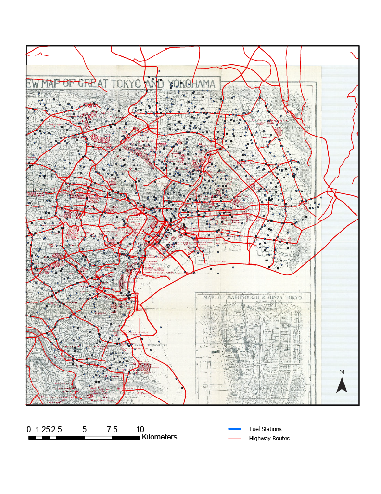
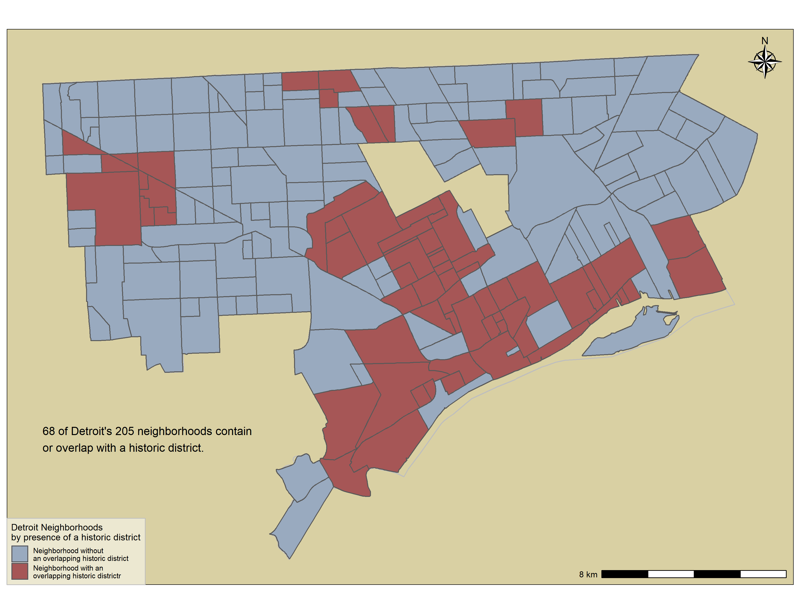
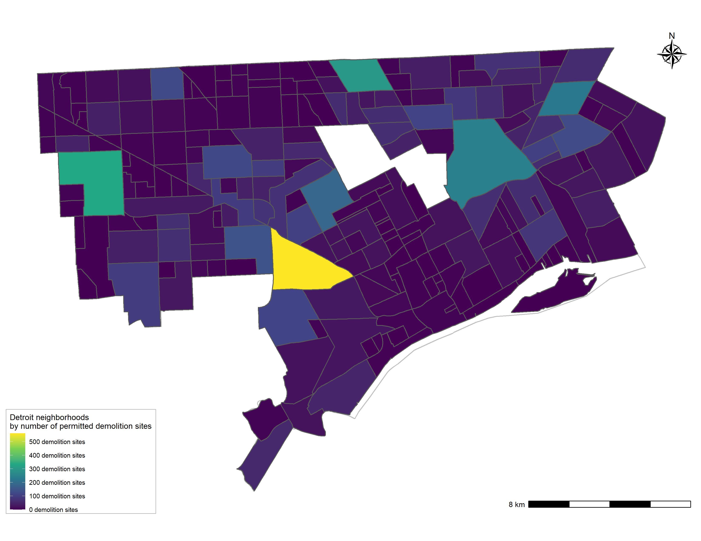
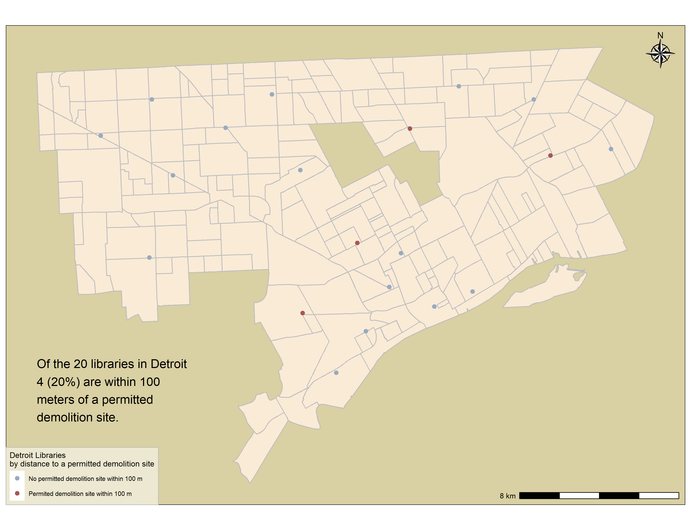
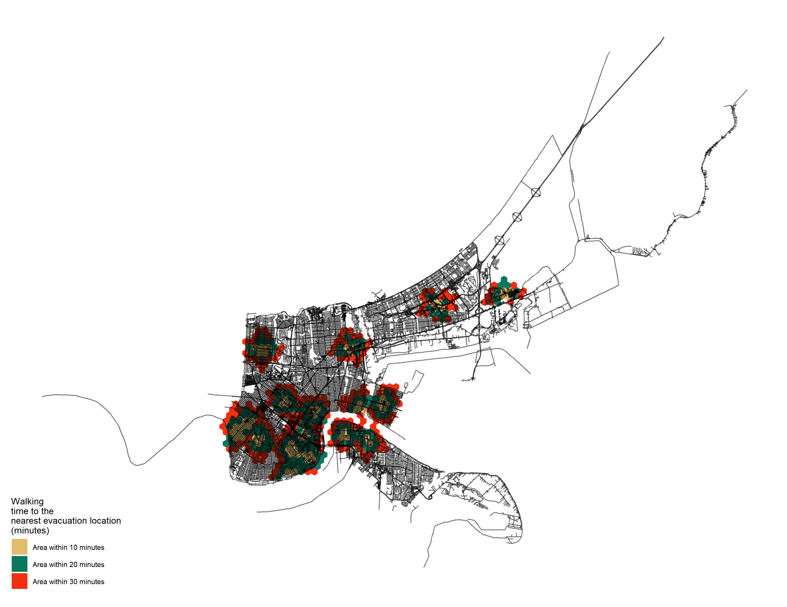
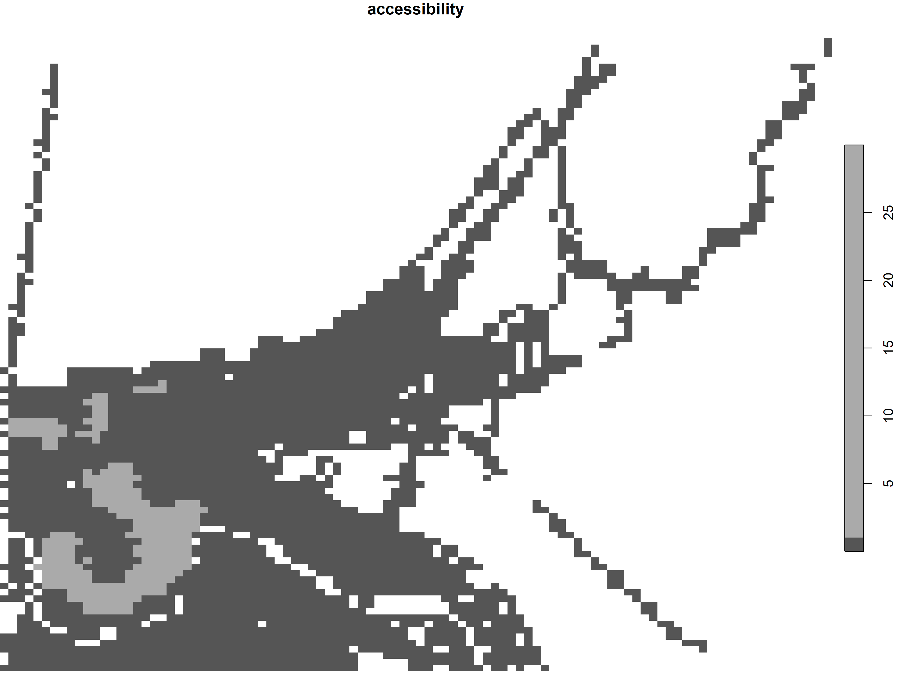
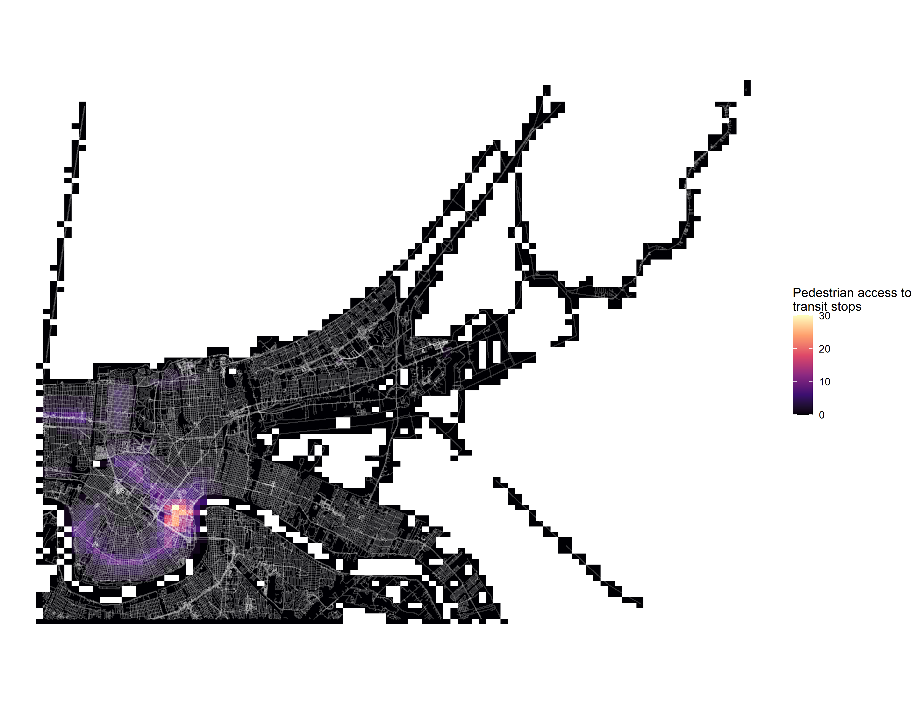
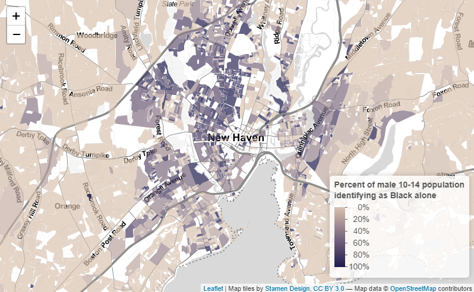

```{r setup, include=FALSE}
knitr::opts_chunk$set(echo = TRUE)
```

# Introduction

This portfolio was created for VIS 2128: Spatial Analysis, a course within the Harvard Graduate School of Design's Master in Urban Planning (MUP) Program. The visualizations within this portfolio demonstrate the skills I have developed using ArcGIS and RStudio this semester.  

For this portfolio, I have included products of several assignments this semester in which I was able to gather data from municipal open data portals and explore topics of interest to me. Specifically, this portfolio features maps of Tokyo (Japan), Detroit (Michigan), New Orleans (Louisiana), and my home region of New Haven County (Connecticut).  

Thank you to the VIS 2128 teaching team for your support throughout this module in learning these skills and troubleshooting issues along the way.  

# Tokyo, Japan

## **Georeferencing**

This map overlays present-day highway routes and fuel stations within Tokyo, Japan on top of an historical map of Great Tokyo and Yokohama from 1934 (Source: Harvard University Map Collection).  

The routes show the extent to which Tokyo's highway infrastructure today has built off of the 1934 landscape and expanded beyond the land mass of the region from that era.  

**This map demonstrates the following skills:**  

* Displaying raster data on a map  
* Georeferencing a raster image  

[](https://abrazak95.github.io/spatialanalysisportfolio/fullsize/Tokyo Georeference 3 - Fuel Stations and Highway Routes.pdf){target="_blank"}

# Detroit, Michigan

## **Visualizing Spatial Relationships**

The following three maps present spatial relationships between points and polygon data in the City of Detroit.  
Specifically, I wanted to think about spatial memory and sites for holding or losing local history within a city by using Detroit's neighborhoods, historic districts, libraries, and demolition sites as data to explore.  

**These maps demonstrate the following skills:**  

* Displaying multiple vector layers on the same map  
* Calculating and displaying relationships among point and polygon layers based on distance  
* Aggregating point data to a layer of polygons  

This first map shows the number of historic districts that overlap with neighborhoods in Detroit. These would be neighborhoods to focus on when thinking about efforts of historic preservation in the city at a neighborhood level.  

[](https://abrazak95.github.io/spatialanalysisportfolio/fullsize/DetroitNeighborhoodsHistoric.pdf){target="_blank"}

This second map shows neighborhoods in Detroit by the number of demolition sites with city permits. This map could be helpful in identifying which neighborhoods are experiencing higher rates of demolition than others. It could also be compared with the previous map to think of how historic districts may be in proximity to these demolition sites.  

[](https://abrazak95.github.io/spatialanalysisportfolio/fullsize/DetroitHoodsDemolition.pdf){target="_blank"}

This third map shows the number and percentage of public libraries in Detroit that are within 100 meters of a permitted demolition site. As the city thinks of preserving the history and memories of particular neighborhoods, they may consider the role that nearby libraries can play in holding those histories safely and presenting them back to the public.  

[](https://abrazak95.github.io/spatialanalysisportfolio/fullsize/DetroitLibrarieswithinDemolition.pdf){target="_blank"}

# New Orleans, Louisiana

## **Accessibility**

The following three maps present accessibility to evacuation locations and street car stops within the City of New Orleans. I chose to look into evacuation locations after New Orleans was terribly struck by Hurricane Ida this year and in consideration of how the city is in constant need of preparing for dangerous weather events. The street car stops were interesting to explore as they represent an historical mode of transportation that has persisted within the city despite the addition of a modern bus system.  

**These maps demonstrate the following skills:**  

* Displaying multiple vector layers on the same map  
* Calculating and displaying accessibility, based on travel time  
* Converting between raster layers and vector layers  
* Calculating and displaying relationships among point and polygon layers based on distance  
* Displaying raster data on a map  

This map shows the area within each of a set of cutoff walking times to the evacuation locations. The map shows the travel time within 10, 20, and 30 minutes.   

[](https://abrazak95.github.io/spatialanalysisportfolio/fullsize/NewOrleansEvacIso.pdf){target="_blank"}

This second map shows an accessibility score for street car stops in the city by converting the map's vector layer to a raster layer.  

[](https://abrazak95.github.io/spatialanalysisportfolio/fullsize/NewOrleansRasterize.pdf){target="_blank"}

This third map shows that same raster layer from above with color and an overlay of the city's street network to better visualize the accessibility score for street car stops.

[](https://abrazak95.github.io/spatialanalysisportfolio/fullsize/NewOrleansRasterStreets.pdf){target="_blank"}

# New Haven County, Connecticut

## **Interactive Map with Census Data**

*"In Moonlight Black Boys Look Blue"  *

This interactive map uses 2010 U.S. Census block data to represent the percentage of male-identifying people ages 10-14 who identify as Black alone within New Haven County, Connecticut. I was 13 or 14 when the 2010 Census was conducted so I made this considering where Black boys like me were living during that time in my home region of New Haven County.  

The color palette for this map was derived from a scene featuring the character Little in the 2016 movie *Moonlight* (dir. by Barry Jenkins) and the title was derived from the original play that inspired *Moonlight* written by Tarell Alvin McCraney.  

**This map demonstrates the following skill:  **

* Displaying data on an interactive map 

**(Click on the image below to open the interactive map!)**

[](https://abrazak95.github.io/spatialanalysisportfolio/fullsize/Black_Boys_GNH.html){target="_blank"}
